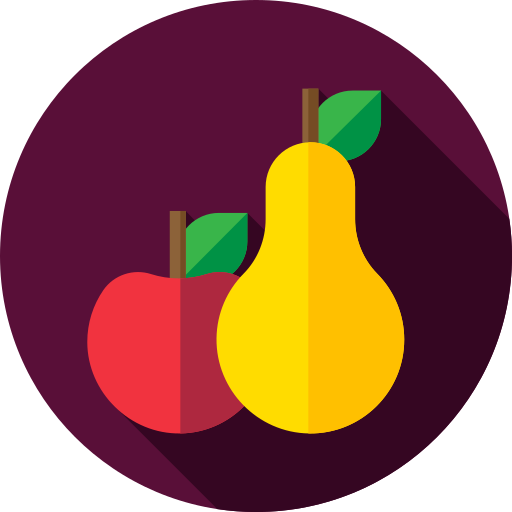
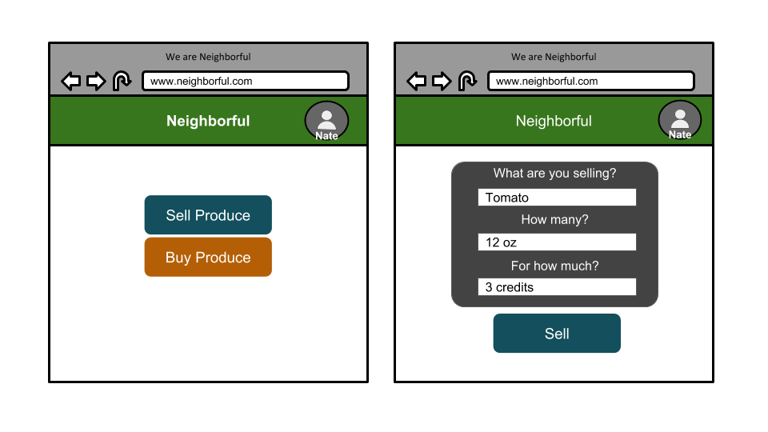
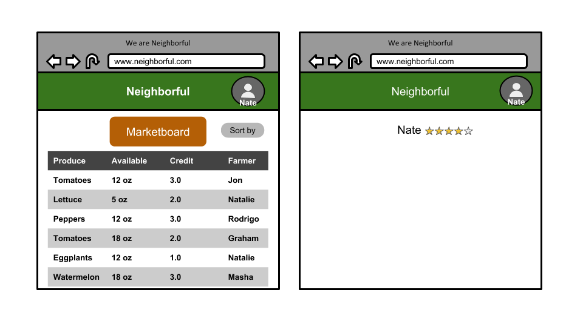
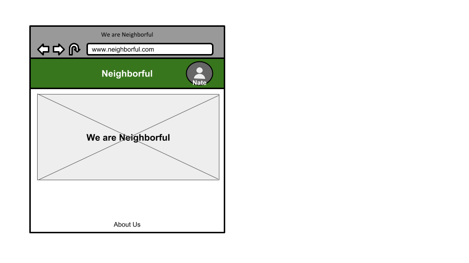
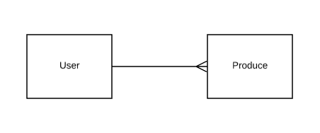
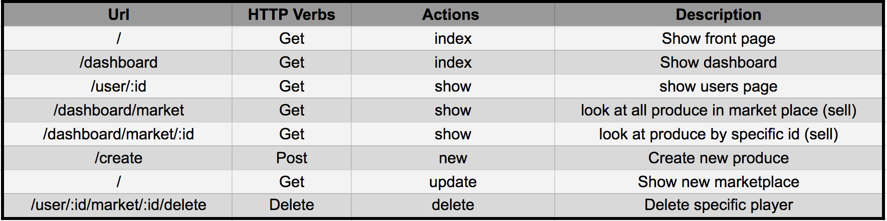

# Neighborful
Neighborhood produce exchange, where neighbors grow and share fresh produce with other neighbors.

Web demo: ([link](https://neighborful-demo.herokuapp.com/))

## Installation
```
$ git clone <this repo>
$ cd Neighborful
$ pipenv install
$ python3 manage.py runserver
```

## Technologies

- [Django](https://www.djangoproject.com/) - A web framework, written in Python, which follows the model-view-template architectural pattern.

- [Python](https://www.python.org/) - An interpreted high-level programming language for general-purpose programming.

- [CSS3](http://www.css3.info/) - Cascading Style Sheets is a style sheet language used for describing the presentation of a document written in a markup language.

- [Bootstrap4](https://getbootstrap.com/) - A front-end library for designing websites and web applications. It contains HTML- and CSS-based design templates for typography, forms, buttons, navigation and other interface components, as well as optional JavaScript extensions.

- [Google Maps API](https://developers.google.com/maps/) - An API used for displaying map data on web applications.

## Minimum Viable Product

The Minimum Viable Product version of the Neighborful web app is a much simplified version of what the final app will be. What follows is the specs for the minimal viable product. A central Kanban board tracking development is located here on [Trello](https://trello.com/b/J1FgDYrT/neighborful). For the most up to date developments, take a quick look inside.

### Wireframes





### User Stories
1. Miguel Cobos
A 27 year old engineer who is an amateur gardener, living in Hyde Park neighborhood of Austin, TX. He grows handful of vegetables in his apartment, and would like to connect to other neighbors who share similar hobbies, and be able to exchange different produces grown right in his neighborhood.
* As user, he'd like to see the type of produce others have available and the credit they'd like to exchange them for.

2. Stephen Borne
A 55 year old man who has been living in Austin his whole life. After recently having a heart attack, his doctor told him he has to start eating healthier or else. Stephen wants to get the freshest, local sourced vegetables and fruits possible.
* As a user, he'd like to sort thru the marketplace to look for specific products.
* As a user, he'd like to see the different produce options available around him, more specifically on a map.

3. Sandy Lakes
A community leader who has started many community gardens around the Austin area. She wants to find a way to get people not in the garden project to get involved and have access to locally grown produce.
* As a user, she'd like to update the quantity of a specific produce item availability.
* As a user, she'd like to be able to delete the produce when its sold out.
* As a user, she'd like to input what produce is being sold and for how many tokens it's being sold for.


### Entity Relationship Diagram



### Routes


## Learn more about the developers of Neighborful

#### Tess Craig
- [Linkedin](https://www.linkedin.com/in/tessashleycraig/)
- [Github](https://github.com/TessACraig89)

#### Neo Jang
- [Linkedin](https://www.linkedin.com/in/neojang/)
- [Github](https://github.com/njang)

#### Aleena Madni
- [Linkedin](https://www.linkedin.com/in/aleena-madni/)
- [Github](https://github.com/aleenamad)
