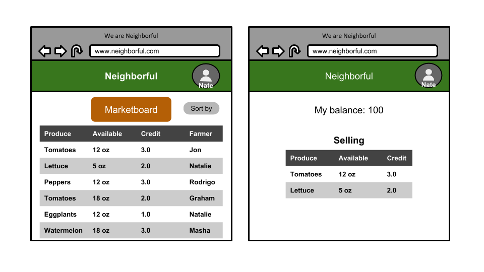

# Neighborful
Neighborhood produce exchange, where neighbors grow and share fresh produce with other neighbors.

## Installation
```
$ git clone <this repo>
$ cd Neighborful
$ python3 manage.py runserver
```

## Minimum Viable Product

The Minimum Viable Product version of the Neighborful web app is a much simplified version of what the final app will be. What follows is the specs for the minimal viable product. A central Kanban board tracking development is located here on [Trello](https://trello.com/b/J1FgDYrT/neighborful). For the most up to date developments, take a quick look inside.

### Wireframes





### User Stories

### Entity Relationship Diagram


## Learn more about the developers of Neighborful

#### Tess Craig
- [Linkedin](https://www.linkedin.com/in/tessashleycraig/)
- [Github](https://github.com/TessACraig89)

#### Neo Jang
- [Linkedin](https://www.linkedin.com/in/neojang/)
- [Github](https://github.com/njang)

#### Aleena Madni
- [Linkedin](https://www.linkedin.com/in/aleena-madni/)
- [Github](https://github.com/aleenamad)
